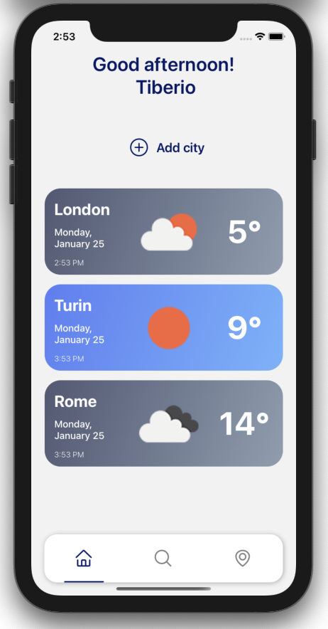
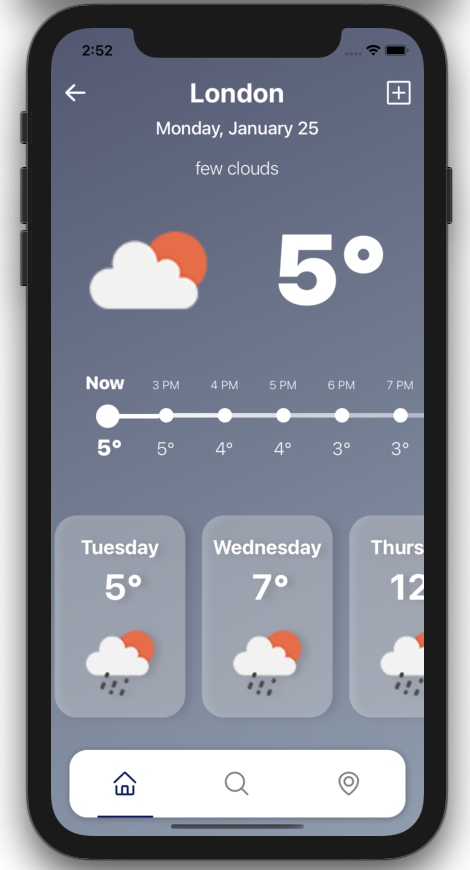

# Weather City App

This is a React Native Weather APP based on [OpenWeather map API ](https://openweathermap.org/api)

## Screenshots
### Home page

### City weather details

### Features Implemented

- [x] Display of current weather from list of favourites
- [x] Weather info with current, daily and hourly weather
- [x] Redux-Saga with Axios for handling API calls
- [x] React Navigation support
- [x] Internationalization support for locale strings and time
- [x] Customizable two color gradients for both day and night
- [x] Theming support
- [ ] Add other cities 
- [ ] Search city
- [ ] Current location weather

## Author 
* [Tiberio Galbiati](https://github.com/TiberioG)
